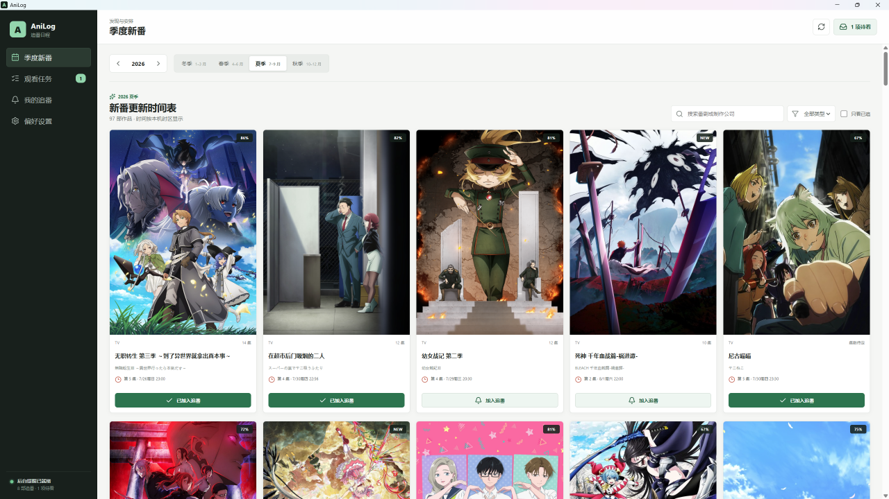
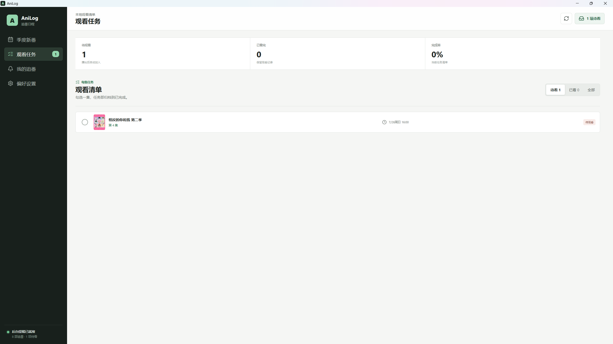
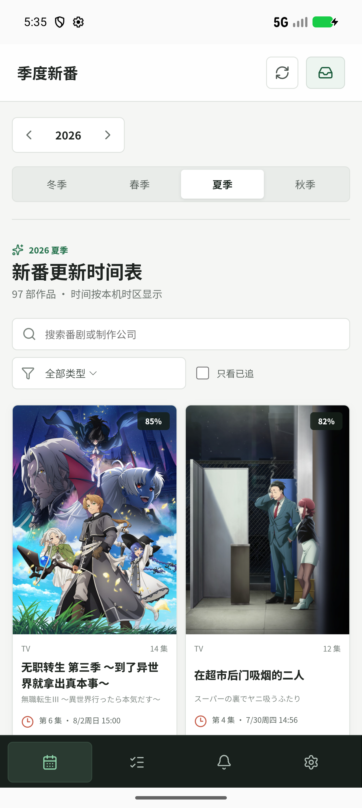

# AniLog

基于 AniList 的本地追番日程与观看任务应用，支持 Windows 和 Android。
A local-first Windows and Android anime schedule, release notification, and episode task tracker.

[](https://github.com/SH1N15/anilog-track/actions/workflows/ci.yml)
[](LICENSE)

## 界面预览

### Windows





### Android

<p align="center">
  
</p>

## 为什么使用 AniLog

- 自动整理每季度新番及下一集播出时间
- 新一集播出后在 Windows 或 Android 发送通知，并可创建待看任务
- 无需注册账号，追番记录和观看任务仅保存在本机
  
## 下载与安装

前往 [GitHub Releases](https://github.com/SH1N15/anilog-track/releases) 下载需要的版本：

- `AniLog Setup x.y.z.exe`：标准版，使用 Bangumi 中文标题
- `AniLog-Original-Setup-x.y.z.exe`：原名版，界面仍为中文，只使用 AniList 的英文、罗马字或日文标题
- [`AniLog-Android-v0.3.1.apk`](https://github.com/SH1N15/anilog-track/releases/download/v0.3.1/AniLog-Android-v0.3.1.apk)：Android 标准版，使用 Bangumi 中文标题

- 支持 Windows 10/11 x64，以及 Android 7.0 或更高版本
- 番剧日程需要网络连接；标准版的在线中文标题查询还会访问 Bangumi API 或配置的反代
- Windows 安装包尚未进行商业代码签名，可能显示“未知发布者”提示
- Windows 更新安装会保留安装目录下的 `data` 文件夹

Android 版使用项目发布密钥签名。后续 Android 更新必须继续使用同一密钥，公开下载包及其 SHA-256 校验值以 GitHub Releases 页面为准。Android 目前只提供标准版。

Windows 版将追番记录、观看任务、缓存和设置保存在 `<安装目录>\data`；Android 版保存在系统分配的应用数据目录。手机和电脑的数据彼此独立，不会自动同步。卸载 Windows 版或移动安装目录前，请备份对应的 `data` 文件夹；卸载 Android 应用会清除手机端本地记录。

## 功能

- 自动打开当前季度的新番列表，并可切换年份、季度、类型与搜索条件
- 自主添加或取消追番，按本机时区显示下一集播出时间
- Windows 应用可驻留系统托盘，定时检查 AniList 播出日程
- 新一集播出后发送系统通知，并自动创建待看任务
- Android 使用系统后台调度校正日程，无需常驻进程；可关闭手机端的自动待看任务，仅保留通知
- 新番列表优先显示 Bangumi 中文标题，匹配不到时回退到英文
- 中文标题会用于搜索、通知和观看任务，也可在“我的追番”中自定义
- 原名版完全不连接 Bangumi，可在“偏好设置 → 番名显示”中选择英文、罗马字或日文标题
- 勾选每集任务，保留已完成观看记录
- 追番、任务和偏好设置仅保存在本机

## 开发运行

```powershell
npm ci
npm run dev
```

使用原名版配置开发运行：

```powershell
npm run dev:original
```

如果 Electron 下载受网络限制，可在 PowerShell 中临时使用镜像后重新安装：

```powershell
$env:ELECTRON_MIRROR='https://npmmirror.com/mirrors/electron/'
node node_modules\electron\install.js
```

浏览器预览地址为 `http://127.0.0.1:5173/`。浏览器模式用于界面预览；后台托盘、开机启动和 Windows 通知仅在 Electron 桌面窗口中生效。

## 构建

```powershell
npm run build
npm run dist
```

构建原名版或一次构建两个安装包：

```powershell
npm run dist:original
npm run dist:all
```

若 Windows 在 Electron 解压阶段报告 `EPERM`，可直接使用项目已安装的 Electron 运行时：

```powershell
npx electron-builder --win nsis --config.electronDist=node_modules/electron/dist
```

两个安装包都会生成在 `release` 目录中。

### Android 构建

Android 版需要 JDK 21、Android SDK 36.1 和对应 Build Tools。首次构建建议先用 Android Studio 安装 SDK，然后在项目根目录运行：

```powershell
npm ci
npm run android:sync
.\android\gradlew.bat -p android assembleDebug
```

Debug APK 生成在：

```text
android/app/build/outputs/apk/debug/app-debug.apk
```

`android/local.properties`、APK、Gradle 缓存、构建目录和签名密钥均被 Git 忽略，不会上传到仓库。发布者必须妥善备份签名密钥；后续更新需要使用相同密钥，并增加 `versionCode` 后重新构建签名 APK 或 AAB。

## 测试

```powershell
npm run build:all
npm run build:android
npm run test:editions
npm run test:window-lifecycle
npm run test:cache-storage
npm run test:season-cache
npm run test:data
npm run test:bangumi
npm audit --omit=dev --audit-level=high
```

## 使用说明

1. 在“季度新番”中选择要追的番剧。
2. Windows 版可保持运行或最小化到系统托盘；Android 版无需常驻后台。
3. 番剧播出后，AniLog 会发送系统通知；启用自动任务时还会添加一条观看任务。
4. 看完后在“观看任务”中勾选对应集数，完成观看任务。

Android 首次追番时需要允许通知。未授予“准时通知”权限时系统仍会发送通知，但可能略有延迟；部分设备还需要将 AniLog 的电池策略设为“不限制”。在系统设置中“强行停止”应用会暂停后台调度，重新打开一次即可恢复。

AniLog 使用 AniList GraphQL API 获取公开番剧与播出日程，并使用 Bangumi 数据补充中文标题，不需要 AniList 或 Bangumi 账号。

AniLog 原名版只使用 AniList GraphQL API。它不会加载 `bangumi-data`，不会注册 Bangumi 通信接口，也不会向 Bangumi 官方 API 或第三方反代发送请求。默认按“英文 → 罗马字 → 日文”显示标题，也可以在设置中改变首选顺序。应用的其他功能与中文标题标准版一致。

中文标题首先来自 `bangumi-data` 的本地节目数据，缺失条目再通过 Bangumi API 查询。应用只查询进入可视区域且尚未缓存的条目，并在网络异常时自动暂停请求。

本地解析优先读取 `bangumi-data` 提供的 AniList ID 映射，再回退到规范化标题、完整首播日期、季度或 Stage 编号、词序相似度和作品类型匹配。一条 AniList 作品对应多个 Bangumi 篇章时，仅在中文标题拥有足够长的共同前缀时合并显示。匹配缓存带有解析器版本，升级算法后会自动重新检查旧的未匹配与歧义结果。

中国大陆网络无法直连 Bangumi 时，应用默认使用 `https://bgmapi.anibt.net` 公共反代。也可在“偏好设置 → 中文标题网络”中填写自建的 HTTPS API 反代地址，或清空地址改用官方 API。地址可填域名根路径或以 `/v0` 结尾的 API 根路径，应用会测试连接后保存；反代失败时自动尝试官方 API，最终回退到本地标题数据。

公共反代与自建方法来自作者的[部署说明](https://catcat.blog/2026/05/bangumi-reverse-proxy.html)和 [Yuri-NagaSaki/bangumi-proxy](https://github.com/Yuri-NagaSaki/bangumi-proxy)。第三方反代可看到请求来源 IP 和被搜索的番剧标题；应用不发送追番清单、观看任务或 Bangumi 登录凭据。

`bangumi-data` 由 [bangumi-data 项目](https://github.com/bangumi-data/bangumi-data)维护，依据 CC BY 4.0 许可使用。

## 许可证

AniLog 源代码使用 [MIT License](LICENSE)。第三方数据和依赖保留各自的许可证，标准版详情见 [THIRD_PARTY_NOTICES.md](THIRD_PARTY_NOTICES.md)，原名版说明见 [THIRD_PARTY_NOTICES_ORIGINAL.md](THIRD_PARTY_NOTICES_ORIGINAL.md)。

AniLog 是非官方客户端，与 AniList、Bangumi 及相关权利方不存在隶属或背书关系。
